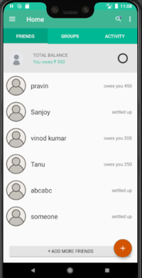
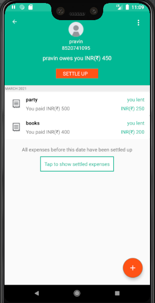
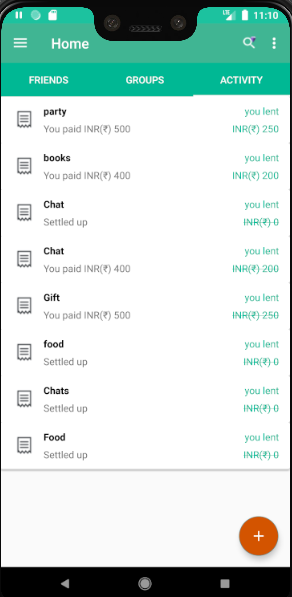

<h1>SplitWise - Clone</h1>

<h4>Splitwise clone app is a free tool for friends and roommates to track bills and other shared expenses, so that everyone gets paid back.</h4>

<H2>#Tech stacks used</h2>
<ul>
    <li>Kotlin</li>
    <li>Java</li>
    <li>MVVM</li>
    <li>Room Database</li>
    <li>Retrofit</li>
</ul>

<H2>Here are some screenshots</H2>

  
  
  
  

<H2>#Dependencies used</h2>

<ul>
    <li>Retrofit -> implementation "com.squareup.retrofit2:retrofit:$retrofit_version"</li>
    <li>Jetpack Navigation -> implementation 'androidx.navigation:navigation-ui-ktx:2.3.3'</li>
    <li>Room libraries implementation "androidx.room:room-ktx:$jetpack_version"</li>
    <li>Glide -> implementation 'com.github.bumptech.glide:glide:4.11.0'</li>
</ul>

<H2> It's a group project</h2>
<h4>We are 4 on the team (Vinod Kumar C, Pravin Pawar, Sanjoy Paul, Harsh Kamaliya).</h4>

<H1>Thank you</h1>
